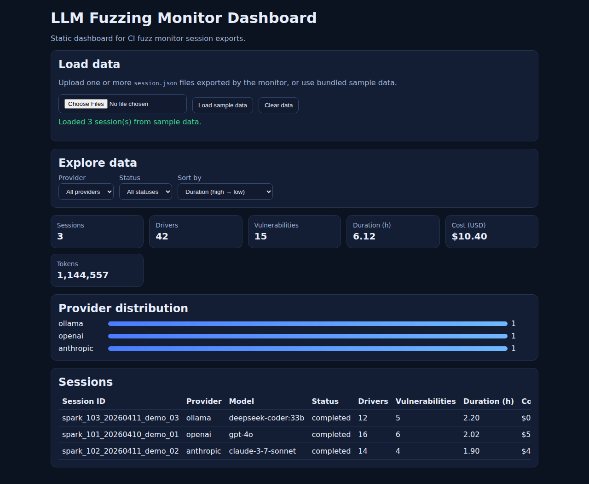
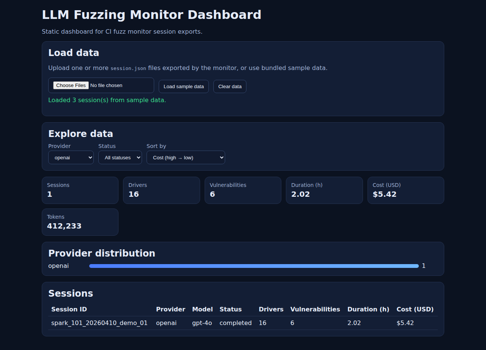
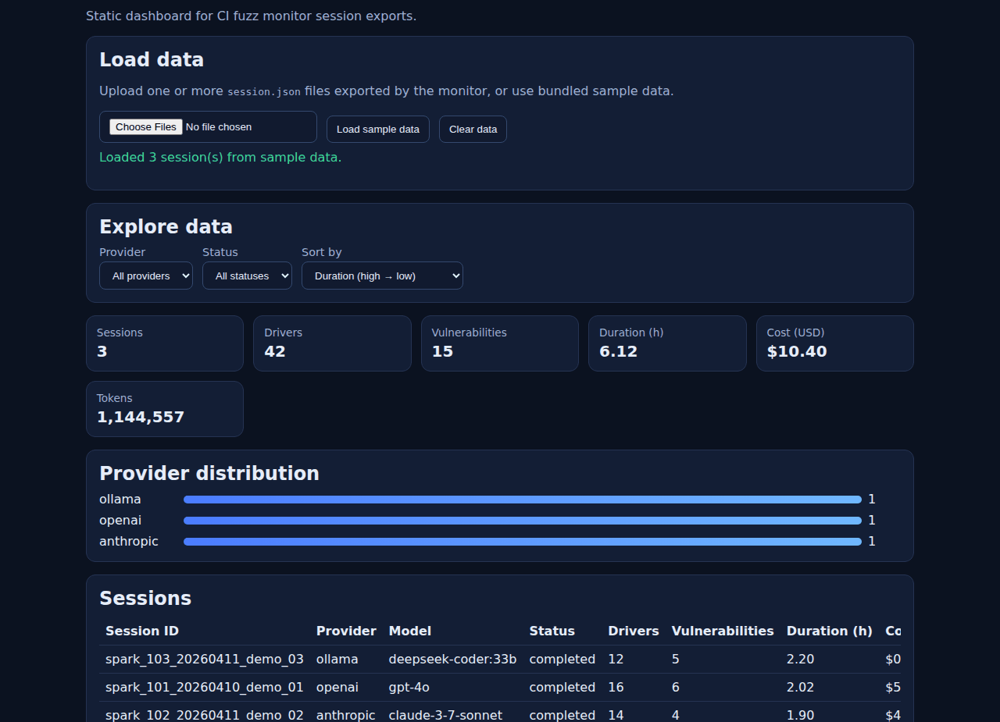

# LLM Fuzz Monitor

> **AI-driven fuzz-testing toolkit** that benchmarks LLM-generated fuzz drivers
> for C/C++ projects, detects hallucinations, analyses code quality &
> vulnerabilities, and orchestrates large-scale comparative experiments.

[](https://github.com/DARREN-2000/LLM-Fuzzing-Monitor-Dashboard/actions/workflows/ci.yml)
[](https://www.python.org/downloads/)
[](LICENSE)

---

## Why This Project?

Modern fuzz testing of C/C++ libraries is bottlenecked by **manual fuzz-driver
authoring**.  Large Language Models can generate fuzz drivers automatically, but
their output is noisy — hallucinated APIs, unsafe patterns, and code that
doesn't even compile.

**LLM Fuzz Monitor** closes that gap by:

| Capability | What It Does |
|---|---|
| **LLM Benchmarking** | Runs 14+ models (Ollama, OpenAI, Anthropic, …) against 60+ C/C++ repos and compares quality metrics. |
| **Hallucination Detection** | Catches fabricated function calls, phantom imports, and semantic inconsistencies in generated code. |
| **Code-Quality Analysis** | Measures cyclomatic complexity, nesting depth, code smells, and computes an overall quality score (0–10). |
| **Vulnerability Scanning** | Pattern-based + taint-tracking detection of buffer overflows, command injection, use-after-free, and more. |
| **Experiment Orchestration** | Clones repos, invokes fuzzers via CI Fuzz, records every LLM interaction, and produces comparative reports. |
| **Thread-Safe Storage** | LZ4-compressed JSON/CSV/SQLite storage with file-locking, async write queues, and automatic log rotation. |
| **Rich CLI Dashboard** | 40+ commands, eight log-format parsers, real-time process monitoring, and export to JSON/CSV/HTML. |

---

## Architecture

```
                    ┌───────────────┐
  60+ C/C++ repos ──►│  Experiment   │
                     │   Runner      │
                     └──────┬────────┘
                            │ clone → invoke CI Fuzz w/ LLM
                            ▼
                     ┌───────────────┐
                     │  LLM Provider │  Ollama · OpenAI · Anthropic · …
                     │   Manager     │
                     └──────┬────────┘
                            │ generated fuzz drivers
                            ▼
          ┌──────────────────────────────────┐
          │        Analysis Engines          │
          │ ┌──────────────────────────────┐ │
          │ │ Hallucination Detector       │ │
          │ ├──────────────────────────────┤ │
          │ │ Code-Quality Analyser        │ │
          │ ├──────────────────────────────┤ │
          │ │ Vulnerability Analyser       │ │
          │ └──────────────────────────────┘ │
          └──────────────┬───────────────────┘
                         │
                         ▼
          ┌──────────────────────────────────┐
          │        Storage Manager           │
          │  JSON · CSV · SQLite + LZ4       │
          └──────────────┬───────────────────┘
                         │
                         ▼
          ┌──────────────────────────────────┐
          │         CLI / Dashboard          │
          │  Rich tables · progress bars     │
          │  8 log parsers · HTML export      │
          └──────────────────────────────────┘
```

See [`docs/architecture.md`](docs/architecture.md) for detailed design decisions.

---

## Quick Start

### 1. Clone & Install

```bash
git clone https://github.com/DARREN-2000/LLM-Fuzzing-Monitor-Dashboard.git
cd LLM-Fuzzing-Monitor-Dashboard

python3 -m venv .venv && source .venv/bin/activate
pip install -r requirements.txt
pip install -e .
```

### 2. Start Ollama (local LLM inference)

```bash
# Install Ollama: https://ollama.com/download
ollama pull deepseek-coder:33b
ollama pull codellama:34b-instruct
```

### 3. Run a Quick Experiment

```bash
# Single model, single repo
python -m llm_fuzz_monitor.experiments.runner \
  --model deepseek-coder:33b \
  --repo zlib

# Full comparative study (all 14 models × all repos)
python -m llm_fuzz_monitor.experiments.runner \
  --config config/experiment_config.yaml \
  --phase validation
```

### 4. Launch the Monitor CLI

```bash
llm-fuzz-monitor --config config/config.yaml
```

### 5. Web Dashboard (Production-ready Static App + GitHub Pages)

The web dashboard is in [`webapp/`](webapp/) and is production-oriented:
- static hosting (no backend required)
- safe rendering for uploaded JSON session files
- KPI cards, provider distribution, sortable/filterable session table
- sample data bootstrap and clear/reset controls

#### Live deployment target
- **GitHub Pages URL**: `https://darren-2000.github.io/LLM-Fuzzing-Monitor-Dashboard/`
- **Deploy workflow**: [`.github/workflows/pages.yml`](.github/workflows/pages.yml)
- **Deploy trigger**: pushes to `main` that modify web assets/docs, or manual `workflow_dispatch`

> If your current branch is not merged to `main` yet, deploy will happen after merge (or manual workflow dispatch from the Actions tab).

#### Start the web app locally (recommended first run)
```bash
cd webapp
python3 -m http.server 8080
```
Open: `http://localhost:8080`

#### What data can it load?
- Bundled sample data: `webapp/sample-data/sessions.json`
- Real monitor exports: one or more uploaded `session.json` files
- Uploaded files can be either a single session object or an array of sessions

#### Dashboard screenshots



#### Short demo clips



For full web dashboard operations and troubleshooting, see [`webapp/README.md`](webapp/README.md).

---

## Docker

Run everything in containers — no local install required:

```bash
# Build & start (Ollama + monitor)
docker compose up -d

# Tail logs
docker compose logs -f monitor
```

The `docker-compose.yml` starts:
- **Ollama** — GPU-accelerated local inference on port `11434`
- **Monitor** — the experiment runner and CLI

---

## Configuration

All configuration lives in `config/`:

| File | Purpose |
|---|---|
| `config.yaml` | LLM endpoints, monitoring intervals, storage settings |
| `models.yaml` | 14 pre-configured Ollama models with token limits and priority |
| `experiment_config.yaml` | 6 experiment phases from quick validation (20 min) to full study (12 h) |
| `repositories.yaml` | 60+ C/C++ test repositories grouped by complexity |
| `llm_environments.yaml` | Per-model environment overrides |

Copy `.env.example` to `.env` to set API keys:

```bash
cp .env.example .env
# Edit .env with your keys (only needed for cloud providers)
```

---

## Pre-Configured Models

| Category | Models |
|---|---|
| **Code Specialists** | `deepseek-coder:33b` · `codellama:34b` · `starcoder2:15b` · `qwen2.5-coder:32b` · `wizardcoder:33b` · `devstral` |
| **General Purpose** | `deepseek-r1:32b` · `qwen3:32b` · `yi:34b` · `gemma3:27b` · `mixtral` · `magistral:24b` · `phi4:14b` · `llama3` |

---

## Test Repositories (60+)

<details>
<summary>Click to expand the full list</summary>

| Group | Repos | Build Time |
|---|---|---|
| **C — extra small** | miniz, stb, minimp3, tinyexpr | ~1 min |
| **C — small** | zlib, libpng, libjpeg-turbo, libwebp, lz4, cJSON, libspng | 2–4 min |
| **C — large** | libxml2, curl, freetype, libarchive, … | 5–10 min |
| **C++ — small** | nlohmann/json, fmt, glm, spdlog, re2, cereal, rapidjson, … | 2–4 min |
| **C++ — large** | protobuf, abseil-cpp, leveldb, rocksdb, opencv, grpc, folly | 8–30 min |

</details>

---

## Development

```bash
# Install dev dependencies
pip install -r requirements-dev.txt
pip install -e ".[dev,perf]"

# Lint
make lint

# Tests (60 unit tests)
make test

# Tests with coverage
make test-cov
```

See [`CONTRIBUTING.md`](CONTRIBUTING.md) for the full contribution workflow.

---

## Project Structure

```
.
├── llm_fuzz_monitor/              # Python package
│   ├── __init__.py                # Lazy imports, package metadata
│   ├── core/
│   │   └── models.py              # Data models, enums, config, exceptions
│   ├── storage/
│   │   └── manager.py             # Thread-safe storage, compression, SQLite
│   ├── analysis/
│   │   └── engines.py             # Hallucination / quality / vuln analysers
│   ├── cli/
│   │   └── main.py                # Rich CLI, log parsers, process monitor
│   └── experiments/
│       ├── runner.py              # Automated experiment orchestration
│       └── monitor.py             # Daemon / entry-point script
├── config/                        # YAML configuration files
├── tests/                         # Pytest test suite (60 tests)
├── docs/                          # Architecture documentation
├── Dockerfile                     # Multi-stage production image
├── docker-compose.yml             # Ollama + monitor stack
├── Makefile                       # Dev shortcuts
├── pyproject.toml                 # PEP 621 packaging
├── requirements.txt               # Production dependencies
├── requirements-dev.txt           # Dev / test dependencies
├── .github/workflows/ci.yml      # CI pipeline (lint → test → docker)
├── LICENSE                        # MIT
└── CONTRIBUTING.md
```

---

## Supported LLM Providers

| Provider | Transport | Auth | Notes |
|---|---|---|---|
| **Ollama** | HTTP REST | None | Local GPU inference — recommended |
| **OpenAI** | HTTP REST | API key | GPT-4, GPT-3.5-turbo |
| **Anthropic** | HTTP REST | API key | Claude 3 family |
| **HuggingFace** | HTTP REST | API token | Inference API |
| **LocalAI** | HTTP REST | None | OpenAI-compatible local server |

Install provider extras as needed:

```bash
pip install -e ".[llm]"     # openai + anthropic
pip install -e ".[perf]"    # lz4, ujson, scipy
pip install -e ".[docker]"  # docker SDK
```

---

## Log Parsers

The CLI ships with eight built-in parsers:

1. **AFL** — `execs_done`, `paths_total`, crashes
2. **LibFuzzer** — `#N INITED`, `exec/s`, coverage
3. **HonggFuzz** — iterations, speed, unique crashes
4. **CI Fuzz** — structured JSON output
5. **LLM output** — token counts, generation time
6. **Compiler** — error / warning extraction
7. **Coverage** — `gcov` / `lcov` percentage parsing
8. **Crash** — ASAN / MSAN / UBSAN reports

---

## Suggested Project Name

If you'd like a catchier name for the repository, here are some options:

| Name | Rationale |
|---|---|
| **fuzzwise** | "Wise" fuzzing powered by LLMs |
| **fuzz-forge** | Forging fuzz drivers with AI |
| **llm-fuzz-bench** | LLM Fuzzing Benchmark — descriptive |
| **autofuzz-ai** | Automated AI fuzzing |

---

## License

[MIT](LICENSE) — use freely for research and production.
